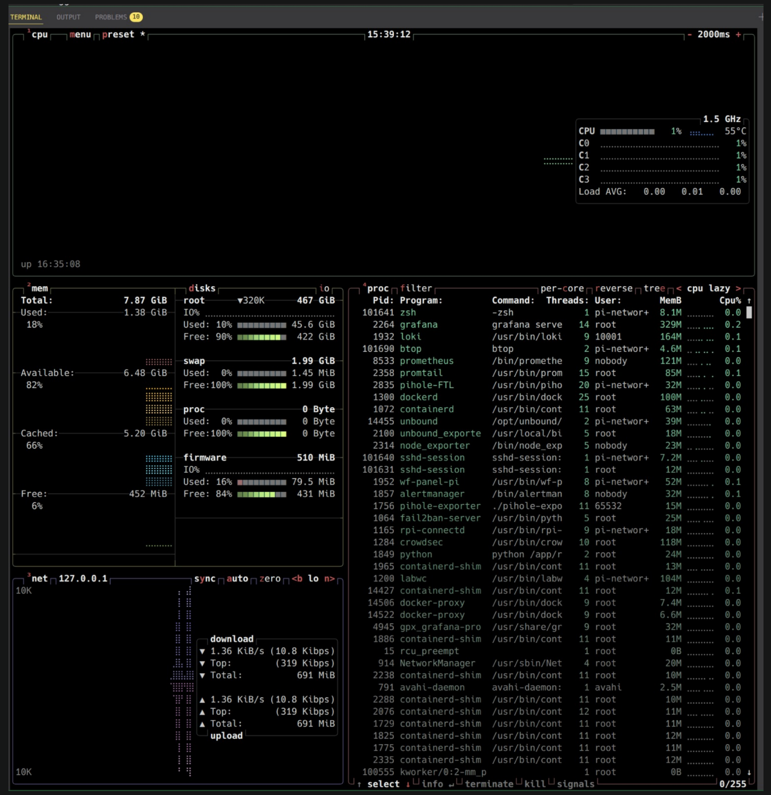
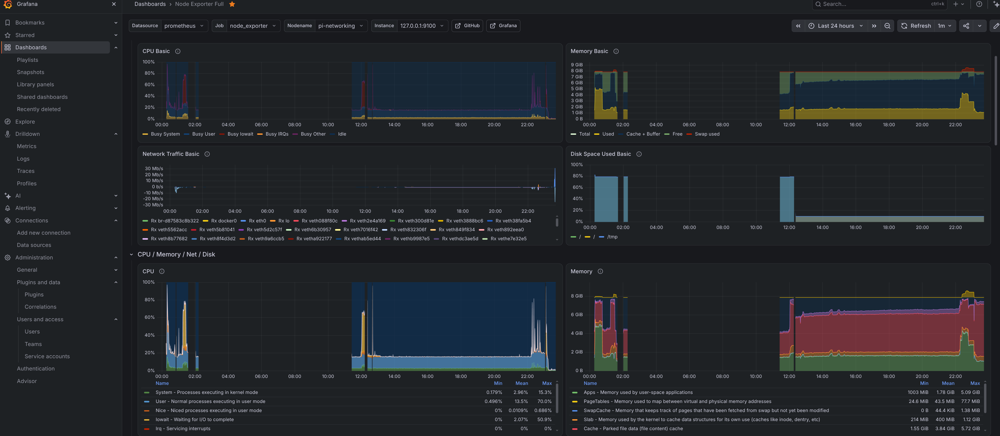
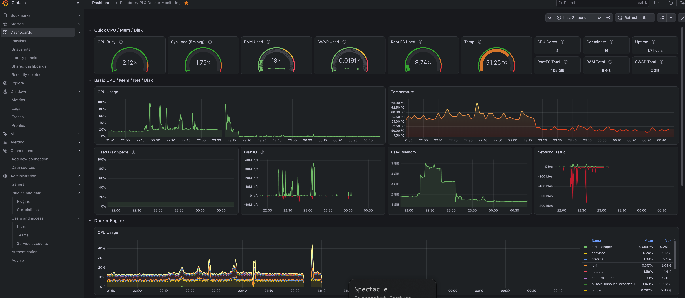
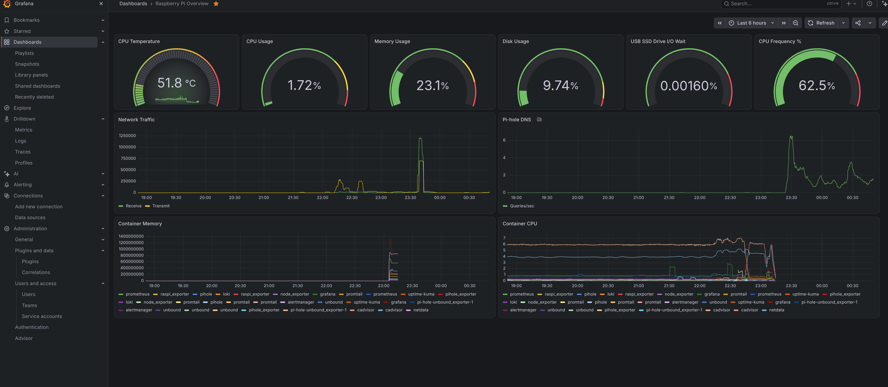

# rasbpi-networking

- [rasbpi-networking](#rasbpi-networking)
  - [Overview](#overview)
  - [But why what does pi-hole and unbound do](#but-why-what-does-pi-hole-and-unbound-do)
    - [🛡️ What Pi-hole Does (The Gatekeeper)](#️-what-pi-hole-does-the-gatekeeper)
  - [🕵️ What Unbound Does (The Private Investigator)](#️-what-unbound-does-the-private-investigator)
    - [🔄 How They Work Together](#-how-they-work-together)
  - [What this project provides](#what-this-project-provides)
    - [Dashboards](#dashboards)
      - [PI-HOLE admin Dashboard](#pi-hole-admin-dashboard)
      - [Node Exporter Full Dashboard](#node-exporter-full-dashboard)
      - [Raspberry PI \& Docker Monitoring Dashboard](#raspberry-pi--docker-monitoring-dashboard)
      - [Raspberry PI Overview Dashboard](#raspberry-pi-overview-dashboard)
    - [Files of interest](#files-of-interest)
    - [Docs (`doc/`)](#docs-doc)
    - [Quick start (on the Pi)](#quick-start-on-the-pi)
    - [Important environment variables](#important-environment-variables)
    - [Runtime overview — what runs and why](#runtime-overview--what-runs-and-why)
    - [Where data is persisted](#where-data-is-persisted)
    - [API authentication / common pitfalls](#api-authentication--common-pitfalls)
    - [Security notes](#security-notes)
  - [Further reading \& troubleshooting](#further-reading--troubleshooting)

## Overview

A Docker-based Pi-hole stack for a Raspberry Pi 5 (arm64) plus a local
monitoring stack. It runs Pi-hole with a local recursive resolver (Unbound) and
Prometheus/Grafana/Loki monitoring on the Pi itself.

This entire stack runs on an 8GB Pi 5 with almost 0% CPU usage.



## But why what does pi-hole and unbound do

- Pi-hole and Unbound work together to create a private, ad-blocking DNS server for your entire home network.  
- When used alone, Pi-hole blocks ads and trackers 
- but must still forward your safe web traffic to a commercial provider like Google or Cloudflare to find websites. 
- Adding Unbound removes those corporations entirely, 
- allowing your home network to look up websites safely and independently. [1, 2] 

------------------------------

### 🛡️ What Pi-hole Does (The Gatekeeper)

[Pi-hole](https://docs.pi-hole.net/guides/dns/unbound/) acts as a local DNS filter for every device connected to your router. [2, 3] 

- Blocks Ads Network-Wide: It prevents ads, tracking scripts, and telemetry data from loading on your phones, smart TVs, and computers.
- Saves Bandwidth: Because ads are blocked before they ever download, your internet runs more efficiently.
- Provides a Dashboard: It features a web user interface detailing which devices are making requests and what data is being blocked. [2, 4, 5] 

## 🕵️ What Unbound Does (The Private Investigator)

Unbound is a secure, local recursive DNS resolver. [3] 

- Bypasses Upstream DNS: Instead of asking Google (8.8.8.8) or Cloudflare (1.1.1.1) to locate a website, Unbound contacts the internet's global DNS root servers directly. [1, 2, 6] 
- Prevents Profiling: No external company gets a full logging history of every domain you visit. [2, 7] 
- Increases Security: It performs native DNSSEC validation to verify that the website addresses returned to you have not been altered or spoofed by hackers. [8, 9]
  
------------------------------

### 🔄 How They Work Together

When you type a website like example.com into your browser, the request follows this process:

[Your Device]
     │
     ▼
[Pi-hole] ──(Is it an ad?)──► YES ──► [Block Request]
     │
     NO
     ▼
[Unbound] ──(Queries Root Servers directly)──► [Finds Website IP]
     │
     ▼
[Your Device] ──► Opens Website

   1. The Check: Your device asks Pi-hole to resolve a domain.
   2. The Filter: If the domain is an ad or malware, Pi-hole blocks it instantly.
   3. The Search: If the domain is safe, Pi-hole passes it to Unbound.
   4. The Resolution: Unbound finds the address directly from the source and hands it back to Pi-hole, keeping your browsing habits local and hidden from third-party tech giants. [1, 2, 7, 10, 11] 

------------------------------

[1] [https://www.youtube.com](https://www.youtube.com/watch?v=oh2FUzAa5s8&t=719)
[2] [https://techodash.com](https://techodash.com/soho-reviews-pi-hole-unbound-review/)
[3] [https://docs.pi-hole.net](https://docs.pi-hole.net/guides/dns/unbound/)
[4] [https://www.reddit.com](https://www.reddit.com/r/pihole/comments/196xn2q/unbound_vs_pihole_navigating_the_adblocking/)
[5] [https://www.youtube.com](https://www.youtube.com/watch?v=6sznCZ7ttbI)
[6] [https://medium.com](https://medium.com/@rajthiru6/the-ultimate-network-privacy-shield-pi-hole-unbound-f1d7b3b602f9)
[7] [https://www.youtube.com](https://www.youtube.com/watch?v=Y3nm519xHfw)
[8] [https://www.reddit.com](https://www.reddit.com/r/opnsense/comments/1h0raav/unbound_vs_pihole_or_unbound_pihole/)
[9] [https://www.youtube.com](https://www.youtube.com/watch?v=X2J3a-x6nWA)
[10] [https://www.reddit.com](https://www.reddit.com/r/pihole/comments/himrrj/how_does_unbound_work/)
[11] [https://discourse.pi-hole.net](https://discourse.pi-hole.net/t/whats-the-difference-between-all-the-different-dns-stuff-unbound-local-dns-adguard-dns-nextdns-google-cloudflare/67974)
[12] [https://www.youtube.com](https://www.youtube.com/watch?v=RoKi4-MCLRw&t=494)

------------------------------

## What this project provides

- A locally built **Pi-hole** image (Pi-hole server + pihole-FTL + web UI).
- An **Unbound** recursive resolver (compiled from source) for DNS privacy and
  performance, bound to `127.0.0.1:5335`.
- Exporters and monitoring:
  - `pihole_exporter` — Pi-hole metrics (port 9617)
  - `unbound_exporter` — Unbound metrics, ar51an/unbound-exporter (port 9167; requires `extended-statistics: yes` in unbound)
  - `node_exporter` — host/system metrics (port 9100)
  - `raspi_exporter` — Raspberry Pi thermal/voltage metrics (port 9779)
  - `docker_exporter` — Docker container metrics, cAdvisor-compatible names (port 9713). See [dlepaux/docker-exporter](https://github.com/dlepaux/docker-exporter).
  - `prometheus` — scrapes the exporters and stores metrics (port 9090)
  - `grafana` — dashboards (port 3000)
  - `alertmanager` — routes alerts from Prometheus (port 9093)
  - `loki` + `promtail` — log aggregation

> NOTE: `cAdvisor` is **not** part of this stack. We use [`docker-exporter`](https://github.com/dlepaux/docker-exporter) instead: it provides cAdvisor-compatible metric names, fixes the zero-memory bug on Raspberry Pi 5 (ARM64 + cgroup v2), and uses far less RAM/CPU. `Uptime Kuma` was also removed to reduce Pi CPU load; references to it in older notes are stale.

### Dashboards

#### PI-HOLE admin Dashboard


#### Node Exporter Full Dashboard



#### Raspberry PI & Docker Monitoring Dashboard



#### Raspberry PI Overview Dashboard



### Files of interest

- `pi-hole/Dockerfile` — Dockerfile for the Pi-hole image build.
- `pi-hole/Dockerfile.unbound` — Dockerfile that compiles Unbound from source.
- `pi-hole/docker-compose.yml` — the full compose stack (services, ports,
  volumes, env, resource limits).
- `pi-hole/.env.example` — example environment file; copy to `.env` and edit.
- `pi-hole/prometheus/prometheus.yml` — scrape targets.
- `pi-hole/prometheus/alert_rules.yml` — alert rules.

### Docs (`doc/`)

- `doc/endpoint-summary.md` — service endpoints, ports, and Prometheus mappings.
- `doc/monitoring-guide.md` — Prometheus/Alertmanager/Grafana and dashboards.
- `doc/docker-commands.md` — sanitized docker/compose commands and auth recipes.
- `doc/docker-update-commands.md` — update/rebuild/maintenance commands.
- `doc/pihole-auth-issues-fixes.md` — Pi-hole v6 API auth troubleshooting (curl).
- `doc/ftl-doc.md` — how the Pi-hole password is provided and API auth works.
- `doc/pihole-exporter.md` — the `pihole_exporter` service.
- `doc/node-exporter.md` — host metrics via `node_exporter`.
- `doc/adding-raspi-exporter.md` — history of adding `raspi_exporter`.
- `doc/docker-exporter.md` — `docker_exporter` service, why it replaces cAdvisor, and compatible Grafana dashboards.
- `doc/unbound-permission-fixes.md` — Unbound logging/exporter fixes.
- `doc/sys time warning fix.md` — fixing the `CAP_SYS_TIME` warning.
- `doc/network-tools-guide.md` — LAN diagnostic tools (run from a desktop, not
  part of the Docker stack).

### Quick start (on the Pi)

1. Copy the example env file and edit values:

   ```bash
   cp pi-hole/.env.example pi-hole/.env
   # Edit pi-hole/.env: set TZ, WEBPASSWORD, SERVERIP
   ```

2. (Optional) Auto-detect `SERVERIP` for DHCP hosts:

   ```bash
   cd pi-hole && chmod +x generate-env.sh && ./generate-env.sh
   ```

3. Build and start the stack:

   ```bash
   cd pi-hole
   # Build local images (recommended on the Pi)
   docker compose build
   # Start everything
   docker compose up -d
   ```

4. Recreate only the `pihole` service after env changes:

   ```bash
   cd pi-hole && docker compose up -d --no-deps --force-recreate pihole
   ```

### Important environment variables

Set these in `pi-hole/.env` (copy from `pi-hole/.env.example`):

- `TZ` — container timezone (e.g. `Europe/London`).
- `WEBPASSWORD` — web/admin password. It is passed to the `pihole` service both
  as `WEBPASSWORD` and as `FTLCONF_webserver_api_password`, so the web UI and the
  FTL HTTP API share one password.
- `SERVERIP` — LAN IP of the Pi (e.g. `192.168.1.5`). Use `auto` and run
  `generate-env.sh` if the Pi gets a dynamic IP.

DNS upstreams (`DNS1`/`DNS2`) and the exporter password are configured directly
in `docker-compose.yml` (Unbound at `127.0.0.1#5335`), not via `.env`.

> The `PIHOLE_API` line that still appears in `.env.example` is **unused** by
> this stack — the `pihole_exporter` authenticates with `WEBPASSWORD` instead.

### Runtime overview — what runs and why

- `pihole` — Pi-hole web UI, pihole-FTL resolver and API (the DNS-blocking core).
- `unbound` — recursive resolver bound to `127.0.0.1:5335` (privacy; no external
  forwarders).
- `pihole_exporter` — scrapes the Pi-hole API, exposes metrics for Prometheus.
- `unbound_exporter` — exports Unbound metrics for Prometheus.
- `prometheus` — scrapes the exporters and stores metrics.
- `grafana` — dashboarding for Prometheus/Loki metrics and logs.
- `alertmanager` — receives alerts from Prometheus and routes notifications.
- `node_exporter`, `raspi_exporter` — host/board metrics for monitoring.
- `loki`, `promtail` — collect and store container and Unbound logs.

### Where data is persisted

- Pi-hole config/gravity: `pi-hole/etc-pihole`
- dnsmasq/Pi-hole DNS config: `pi-hole/etc-dnsmasq.d`
- Unbound config/logs: `pi-hole/unbound`, `pi-hole/unbound/var/log`
- Prometheus/Grafana/Alertmanager/Loki: `pi-hole/prometheus`, `pi-hole/grafana`,
  `pi-hole/alertmanager`, `pi-hole/loki`

### API authentication / common pitfalls

Pi-hole v6 API uses session IDs (`sid`) and CSRF tokens for cookie-based auth.
Common options:

- Use cookie + `X-CSRF-TOKEN`: authenticate via `/api/auth` to obtain a session
  cookie and CSRF token, then send the token in `X-CSRF-TOKEN` on subsequent
  requests. See `doc/pihole-auth-issues-fixes.md` for exact curl examples.
- Use header-based SID: include `X-FTL-SID: <sid>` (obtained from `/api/auth`)
  for scripted clients — avoids cookie/CSRF complexity.

If you see `401 Unauthorized` on actionable endpoints, ensure:

- You set `WEBPASSWORD` (and therefore `FTLCONF_webserver_api_password`) in
  `pi-hole/.env` — prefer the env variable over in-container changes.
- Host/cookie mismatch: Pi-hole sets the session cookie for a specific domain
  (e.g. `pi.hole`). When using curl or a reverse proxy, make the `Host` header
  and cookie domain match the configured `webserver.domain` (see
  `pi-hole/etc-pihole/pihole.toml`).

### Security notes

- This stack is for home/lab use. Do not expose the Pi-hole web UI or exporters
  to the public internet without a firewall / reverse-proxy auth.
- `pi-hole/.env` contains `WEBPASSWORD` and is git-ignored — never commit it.
- No secrets are stored in this repository. If you must handle tokens, read them
  from the env file at runtime and never paste them into docs or commands.

## Further reading & troubleshooting

- `doc/endpoint-summary.md`
- `doc/monitoring-guide.md`
- `doc/docker-commands.md`
- `doc/pihole-auth-issues-fixes.md`
- `doc/ftl-doc.md`
